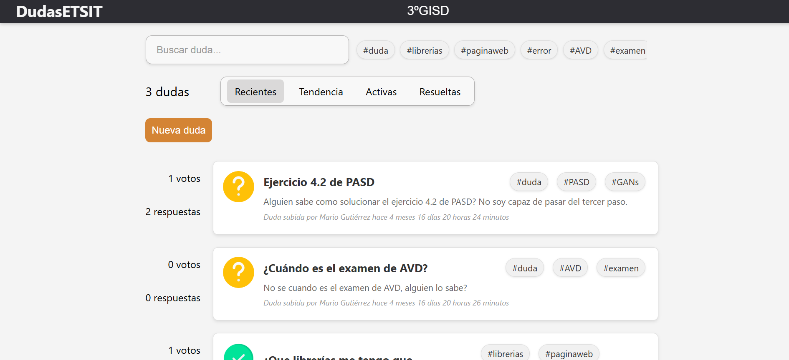
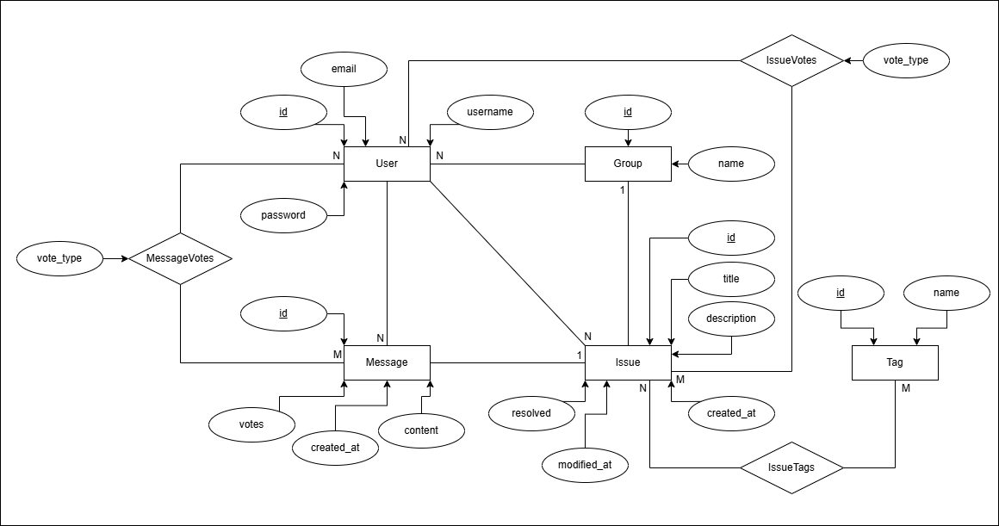

# Dudas ETSIT

Dudas ETSIT is a web application developed in Flask to manage questions and discussions within a student group. It enables user authentication, voting, and commenting on various topics.

## Features
- **User authentication**: Register and log in.
- **Voting system**: Users can vote for the best answers and issues.
- **Messages and comments**: Users can post questions and respond to others.
- **Simple web interface** based on HTML and CSS.

## Requirements
- Python 3.8+
- pip

## Installation
1. Clone this repository:
   ```bash
   git clone https://github.com/mario11gd/dudasETSIT.git
   cd dudasETSIT
   ```
2. Create and activate a virtual environment:
   ```bash
   python3 -m venv venv
   source venv/bin/activate  # On Windows use: venv\Scripts\activate
   ```
3. Install dependencies:
   ```bash
   pip install -r requirements.txt
   ```

## Usage
1. Load the groups into the database:
   ```bash
   python scripts/load_groups.py
   ```
2. Run the application:
   ```bash
   python app.py
   ```
3. Access the application at `http://127.0.0.1:5000/`


Log in is required to create new issues or interact with any existing one.

## Database Structure
The database structure is represented in the following diagram:



## Project Structure
```
/
├── app.py              # Main application file
├── requirements.txt    # Project dependencies
├── static/             # Static files (images)
├── templates/          # HTML templates
├── database_structure/ # Database structure
└── scripts/            # Auxiliary scripts
```

## Contribution
If you want to contribute, fork the repository, create a branch with your changes, and submit a pull request.

## License
This project is licensed under the MIT License.
See the [LICENSE](LICENSE) file for details.